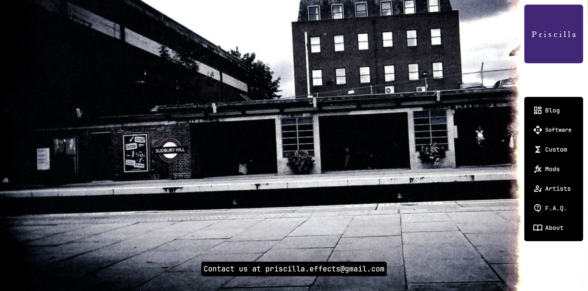

    

    <b><em>Priscilla FX</em></b>

    <em>Проект создан в качестве интернет-магазина и информационного ресурса мастерской Priscilla FX.</em>

## Структура проекта

    

## Сайт создан с использованием следующих технологий:

**Backend фреймворк:**

- **FastAPI** - Современный, высокопроизводительный веб-фреймворк для создания API.
- **FastAPI-Users** - Пакет для управления аутентификацией и регистрацией пользователей в приложениях FastAPI.

**Frontend фреймворк:**

- **Next.js** - Современный, высокопроизводительный веб-фреймворк для создания интерфейсов.

**База данных:**

- **Asyncpg** - Асинхронный интерфейс PostgreSQL.
- **SQLModel** - Предназначена для упрощения взаимодействия с базами данных SQL в приложениях FastAPI.
- **SQLAlchemy** - SQL-инструментарий и система объектно-реляционного отображения (ORM).
- **Alembic** - Инструмент миграции базы данных.

**Кэширование данных:**

- **FastAPI-Cache** - Пакет для кэширования с помощью Redis.
- **Redis** - Система хранения данных в памяти, используемая в качестве базы данных, кэша и брокера сообщений.

**Развёртывание приложения:**

- **Docker** - Платформа для разработки, доставки и запуска приложений в контейнерах.

Сайт имеет систему аутентификации пользователей с использованием **JSON Web Tokens (JWT)** и **cookie**.
Имеет систему миграции базы данных с помощью **Alembic**. Это позволяет легко управлять изменениями схемы базы данных.

    
    
    

## License

This project is licensed under GPL-3.0. Please refer to the [LICENSE](LICENSE) file for detailed license information.
